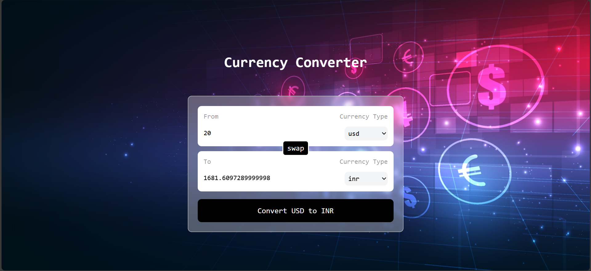

## Currency Converter App Developed with ❤️ by Syed Tanzeel Adnan
<br>

This project is a simple **Currency Converter App** built with **React**. It allows users to convert between various currencies by selecting the "from" and "to" currencies and entering the amount. The app fetches real-time exchange rates using an external API.

<hr style="border: none; border-top: 0.2px solid #ccc;" />





## Features

- Real-time currency conversion based on user input
- Swap functionality to switch between "from" and "to" currencies
- Clean and responsive UI with background image
- Handles dynamic exchange rates fetched from a public API
- Input validation and proper handling of empty or invalid inputs

## Technologies Used

- React (Functional Components, Hooks)
- JavaScript (ES6+)
- Tailwind CSS for styling
- Currency API for real-time exchange rates

## Getting Started

### Prerequisites

Before you begin, ensure you have the following tools installed:

- [Node.js](https://nodejs.org/) (v12 or higher)
- [npm](https://www.npmjs.com/) or [yarn](https://yarnpkg.com/)

### Installation

1. **Clone the repository:**

   ```bash
   git clone https://github.com/yourusername/currency-converter-app.git
2. **Navigate to the project directory:**
   ```bash
   cd currency-converter-app
3. **Install the dependencies:**
    ##If you're using npm:
     ```bash
     npm install
     ```
     ##If you're using yarn:
      ```bash
      yarn install
      ```
4. **Running the App:**
   ##1.Start development server:
       ##If you're using npm:
       ```bash
       npm start ```
       ##If you're using yarn:
       ```bash
       npm yarn ```
   ##2. Open your browser and go to http://localhost:3000. You should see the Currency Converter app running.

## API Usage:
The app uses the [Currency API by Fawaz Ahmed](https://github.com/fawazahmed0/currency-api) to fetch live exchange rates.

The API is accessed in the custom hook useCurrencyInfo.js, which retrieves currency conversion rates based on the selected "from" currency.

<br>
<br>
<hr style="border: none; border-top: 0.2px solid #ccc;" />
##Developed with ❤️ by Syed Tanzeel Adnan
